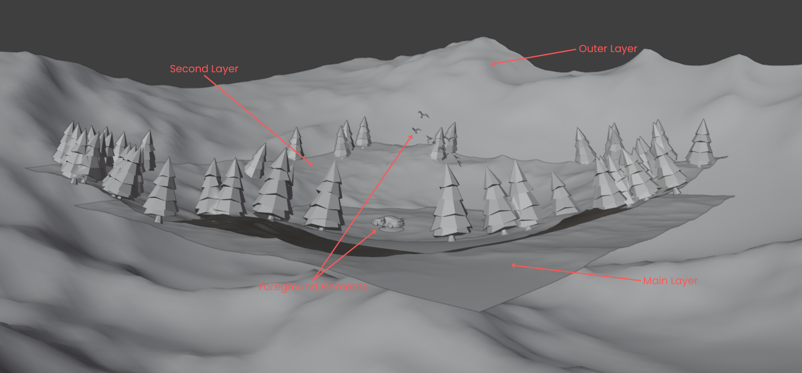
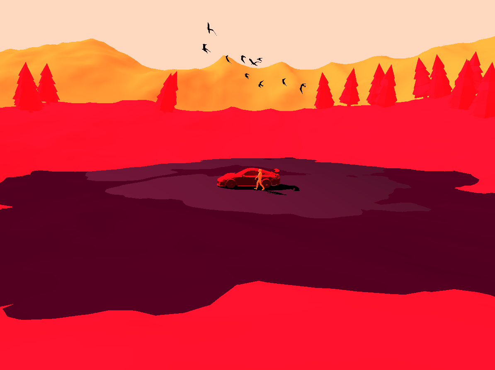

# 3D-Car-Scene

Mincu Adrian-Lucian 332

## Task

Create a complex 3D scene.

## Project Concept

### Description

This project has it's main focus at a car placed in the center of a scenic mountain view. The entire scene has a stylized cartoon effect, creating a vibrant visual experience. A parallax effect enhances depth perception, making the scene dynamic.

### Controls

- **Camera Movement**:
  - `↑` : Rotate the camera upward around the car.
  - `↓` : Rotate the camera downward around the car.
  - `←` : Rotate the camera left around the car.
  - `→` : Rotate the camera right around the car.

- **Zoom**:
  - `-` : Zoom out.
  - `+` : Zoom in.

## Originality of the Approach

This project brings originality to its style. The combination of low-poly meshes for background objects and more finely detailed meshes for foreground objects, coupled with a cartoon aesthetic and parallax effect creates a visually dynamic scene.

The deliberate use of varied levels of detail guides the viewer's focus, drawing attention to key elements while maintaining an engaging.

This creative blend of effects gives this scene its uniqueness.

## Features

- **Central Focus**: The car serves as the focal point of the scene, surrounded by a picturesque mountain landscape.

- **Cartoon Style**: The scene adopts a cartoonish aesthetic with bright, bold colors and simplified shapes. This was achieved by setting a high value for the ambient strength.

> main.cpp
```c++
// ambient strength
glUniform1f(ambientStrengthLocation, 1.0f);
```

> shader.frag
```c++
uniform float ambientStrength;
 
void main(void)
{
    switch (codCol) {
        case 0:
            // Ambient
            float _ambientStrength = ambientStrength;
            vec3 ambient = _ambientStrength * lightColor;
        // ...
    }
}
```

- **Parallax Effect**: Adds a sense of depth to the scene by simulating different motion speeds for foreground and background elements. This can be achieved by `layering` the scene based on the foreground and background elements.



- **Shadow Projection**: The shadows of the car and the racer are projected onto the ground using the following shadow matrix:

```c++
float D = -0.5f;
	shadowMatrix[0][0] = zL + D; shadowMatrix[0][1] = 0; shadowMatrix[0][2] = 0; shadowMatrix[0][3] = 0;
	shadowMatrix[1][0] = 0; shadowMatrix[1][1] = zL + D; shadowMatrix[1][2] = 0; shadowMatrix[1][3] = 0;
	shadowMatrix[2][0] = -xL; shadowMatrix[2][1] = -yL; shadowMatrix[2][2] = D; shadowMatrix[2][3] = -1;
	shadowMatrix[3][0] = -D * xL; shadowMatrix[3][1] = -D * yL; shadowMatrix[3][2] = -D * zL; shadowMatrix[3][3] = zL;
```

- **Light**: A light source has been added to the scene to enhance the visibility of shadow effects and bring out finer details in the foreground elements.



The main code that generates this effect:

> shader.frag
```c++
#version 330 core
 
in vec3 FragPos;  
in vec3 Normal; 
in vec3 inLightPos;
in vec3 inViewPos;
in vec3 dir;
in vec3 ex_Color; 
 
out vec4 out_Color;
 
uniform vec3 lightColor;
uniform int codCol;
uniform float ambientStrength;
 
void main(void)
{
    switch (codCol) {
        case 0:
            // Ambient
            float _ambientStrength = ambientStrength;
            vec3 ambient = _ambientStrength * lightColor;
            
            // Diffuse 
            vec3 normala = normalize(Normal);
            vec3 lightDir = normalize(inLightPos - FragPos);
            float diff = max(dot(normala, lightDir), 0.0);
            vec3 diffuse = diff * lightColor;
            
            // Specular
            float specularStrength = 0.5f;
            vec3 viewDir = normalize(inViewPos - FragPos);
            vec3 reflectDir = reflect(-lightDir, normala);
            float spec = pow(max(dot(viewDir, reflectDir), 0.0), 1);
            vec3 specular = specularStrength * spec * lightColor;  
            vec3 emission=vec3(0.0, 0.0, 0.0);
            vec3 result = emission + (ambient + diffuse + specular) * ex_Color;
            out_Color = vec4(result, 1.0f);
            
            break;
            
        case 1:
            vec3 black = vec3 (0.0, 0.0, 0.0);
            out_Color = vec4 (black, 1.0);
    }
}
```

## Blender

The 3D application `Blender` was used to create the whole scene. After that, every object was exported as a `.obj` file and rendered with `OpenGL`. 

### Parametric landscapes:

The landscapes were generated with the Blender addon `A.N.T Landscape`. After that a wave modifier was applied to generate the spherical shape.

### OBJs from [Sketchfab](https://sketchfab.com/):

- [Car](https://sketchfab.com/3d-models/2018-porsche-911-gt2-rs-weissach-package-3d84bed1c5794403a80580eebc2a4c72)

- [Racer](https://www.mixamo.com/#/?page=1&type=Character)

- [Tree](https://sketchfab.com/3d-models/low-poly-tree-concept-e815f8acd6d34528a82feef38d5af880)

- [Birds](https://sketchfab.com/3d-models/birds-b2c32bd4b78747e5b061c8348128e205)

### Particle System

On the middle layer the particle system from blender was used to generate multiple trees on the mesh.
  
[Particle System Demo](https://www.youtube.com/watch?v=vzgmremJoPA&list=PLB5_pVetb2rKlQXNZdsS56DFJTQ_9KV5W&index=2)

A weighted paint texture was applied to create a mask that defines where the trees are generated. This approach ensures trees are placed exclusively on the vertices marked with red in the mask.

[Weighted Paint Demo](https://www.youtube.com/watch?v=nsRIg9t9X50&list=PLB5_pVetb2rKlQXNZdsS56DFJTQ_9KV5W&index=2)

## References

My inspiration arose from: [Firewatch Fan Art](https://sketchfab.com/3d-models/firewatch-fan-art-8609caf1cd8c452eb7b6d4ca4228fcd0)